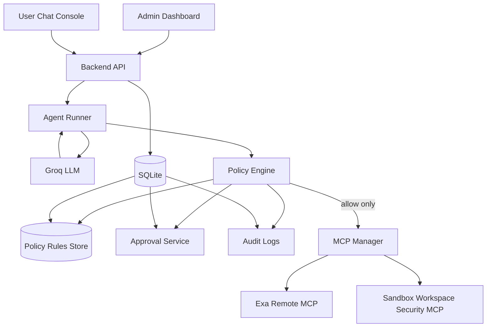

# Architecture Diagram Template

Use this in README.


```mermaid
flowchart TD
  ADMIN[Admin Dashboard] --> API[Backend API]
  USER[User Chat Console] --> API

  API --> AGENT[Agent Runner]
  AGENT --> GROQ[Groq LLM]
  GROQ --> AGENT

  AGENT --> POLICY[Policy Engine]
  POLICY --> RULES[(Policy Rules Store)]
  POLICY --> APPROVAL[Approval Service]
  POLICY --> AUDIT[Audit Logs]

  POLICY -->|allow only| MCPM[MCP Manager]
  MCPM --> EXA[Exa Remote MCP]
  MCPM --> SANDBOX[Sandbox Workspace Security MCP]

  API --> DB[(SQLite)]
  DB --> RULES
  DB --> AUDIT
  DB --> APPROVAL
```

Core security boundary:

```txt
The Groq model can request a tool call.
Only the Policy Engine can authorize MCP execution.
```
